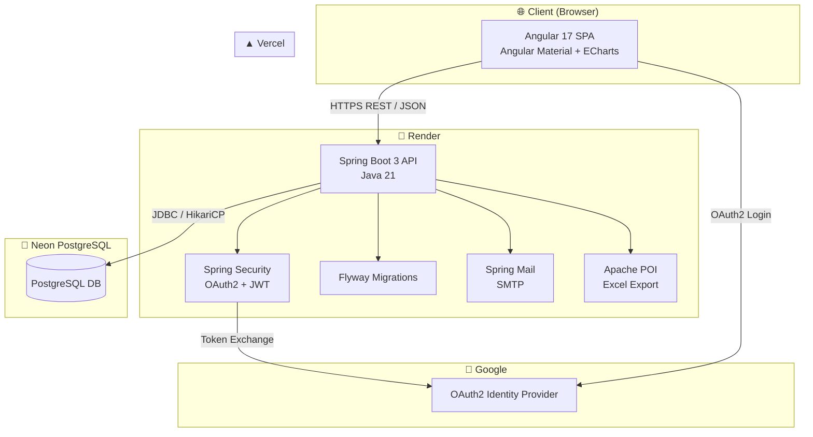
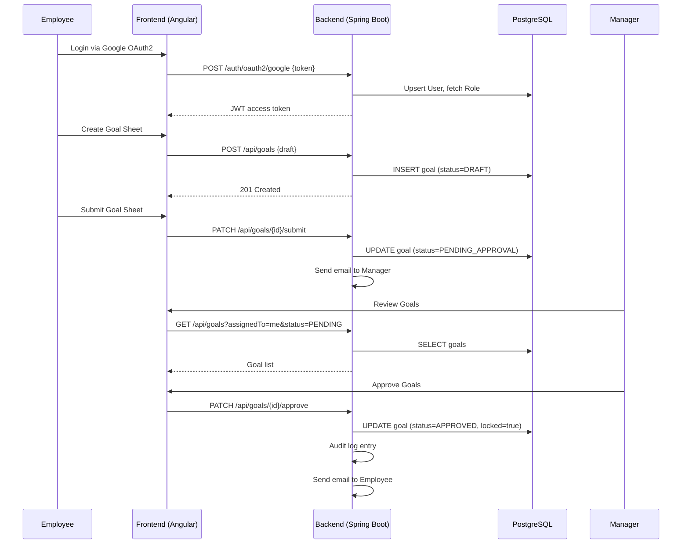
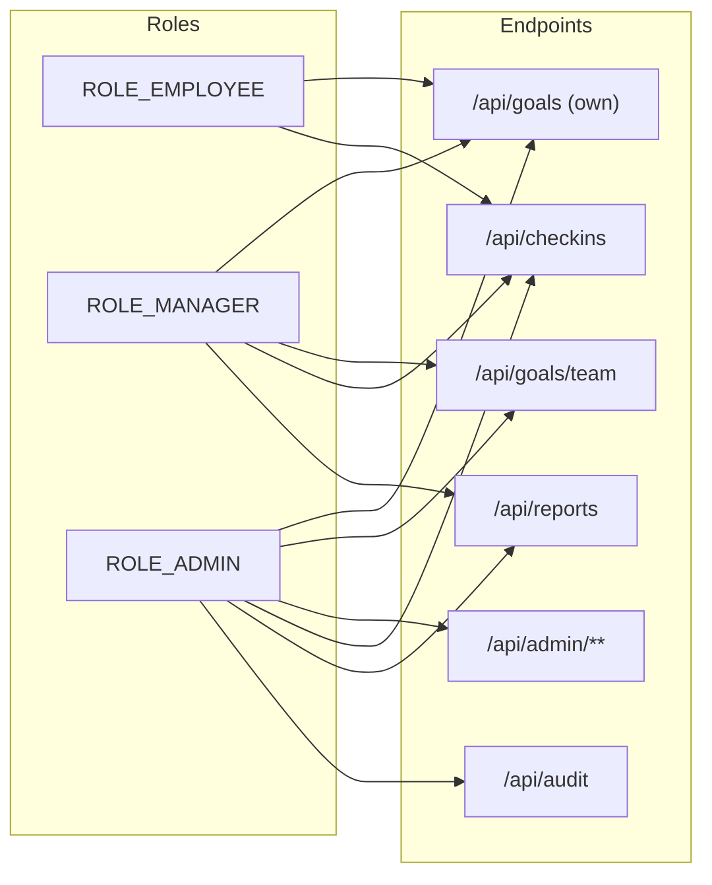
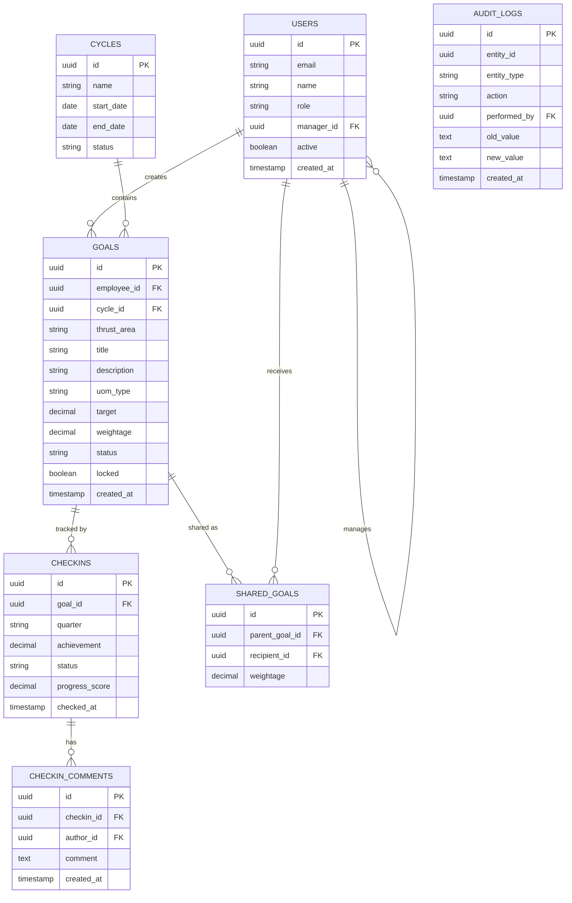

# Architecture Diagram

## System Overview

```mermaid
graph TB
    subgraph Client["🌐 Client (Browser)"]
        A[Angular 17 SPA<br/>Angular Material + ECharts]
    end

    subgraph Vercel["▲ Vercel"]
        A
    end

    subgraph Render["🔷 Render"]
        B[Spring Boot 3 API<br/>Java 21]
        B --> C[Spring Security<br/>OAuth2 + JWT]
        B --> D[Flyway Migrations]
        B --> E[Spring Mail<br/>SMTP]
        B --> F[Apache POI<br/>Excel Export]
    end

    subgraph Neon["🐘 Neon PostgreSQL"]
        G[(PostgreSQL DB)]
    end

    subgraph Google["🔑 Google"]
        H[OAuth2 Identity Provider]
    end

    A -->|HTTPS REST / JSON| B
    B -->|JDBC / HikariCP| G
    C -->|Token Exchange| H
    A -->|OAuth2 Login| H
```

## Data Flow — Goal Lifecycle

```mermaid
sequenceDiagram
    participant E as Employee
    participant FE as Frontend (Angular)
    participant API as Backend (Spring Boot)
    participant DB as PostgreSQL
    participant M as Manager

    E->>FE: Login via Google OAuth2
    FE->>API: POST /auth/oauth2/google {token}
    API->>DB: Upsert User, fetch Role
    API-->>FE: JWT access token

    E->>FE: Create Goal Sheet
    FE->>API: POST /api/goals {draft}
    API->>DB: INSERT goal (status=DRAFT)
    API-->>FE: 201 Created

    E->>FE: Submit Goal Sheet
    FE->>API: PATCH /api/goals/{id}/submit
    API->>DB: UPDATE goal (status=PENDING_APPROVAL)
    API->>API: Send email to Manager

    M->>FE: Review Goals
    FE->>API: GET /api/goals?assignedTo=me&status=PENDING
    API->>DB: SELECT goals
    API-->>FE: Goal list

    M->>FE: Approve Goals
    FE->>API: PATCH /api/goals/{id}/approve
    API->>DB: UPDATE goal (status=APPROVED, locked=true)
    API->>API: Audit log entry
    API->>API: Send email to Employee
```

## Role-Based Access Control

```mermaid
graph LR
    subgraph Roles
        R1[ROLE_EMPLOYEE]
        R2[ROLE_MANAGER]
        R3[ROLE_ADMIN]
    end

    subgraph Endpoints
        E1["/api/goals (own)"]
        E2["/api/goals/team"]
        E3["/api/admin/**"]
        E4["/api/checkins"]
        E5["/api/reports"]
        E6["/api/audit"]
    end

    R1 --> E1
    R1 --> E4
    R2 --> E1
    R2 --> E2
    R2 --> E4
    R2 --> E5
    R3 --> E1
    R3 --> E2
    R3 --> E3
    R3 --> E4
    R3 --> E5
    R3 --> E6
```

## Database Entity Relationships

```mermaid
erDiagram
    USERS {
        uuid id PK
        string email
        string name
        string role
        uuid manager_id FK
        boolean active
        timestamp created_at
    }

    CYCLES {
        uuid id PK
        string name
        date start_date
        date end_date
        string status
    }

    GOALS {
        uuid id PK
        uuid employee_id FK
        uuid cycle_id FK
        string thrust_area
        string title
        string description
        string uom_type
        decimal target
        decimal weightage
        string status
        boolean locked
        timestamp created_at
    }

    CHECKINS {
        uuid id PK
        uuid goal_id FK
        string quarter
        decimal achievement
        string status
        decimal progress_score
        timestamp checked_at
    }

    CHECKIN_COMMENTS {
        uuid id PK
        uuid checkin_id FK
        uuid author_id FK
        text comment
        timestamp created_at
    }

    AUDIT_LOGS {
        uuid id PK
        uuid entity_id
        string entity_type
        string action
        uuid performed_by FK
        text old_value
        text new_value
        timestamp created_at
    }

    SHARED_GOALS {
        uuid id PK
        uuid parent_goal_id FK
        uuid recipient_id FK
        decimal weightage
    }

    USERS ||--o{ GOALS : "creates"
    USERS ||--o{ USERS : "manages"
    CYCLES ||--o{ GOALS : "contains"
    GOALS ||--o{ CHECKINS : "tracked by"
    CHECKINS ||--o{ CHECKIN_COMMENTS : "has"
    GOALS ||--o{ SHARED_GOALS : "shared as"
    USERS ||--o{ SHARED_GOALS : "receives"
```
